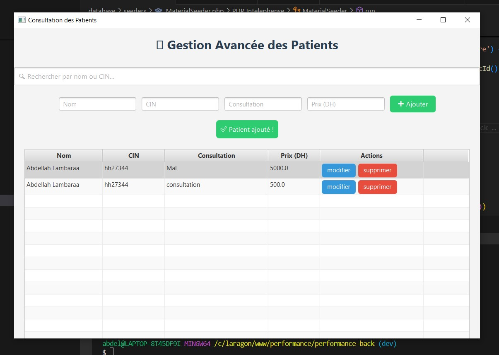
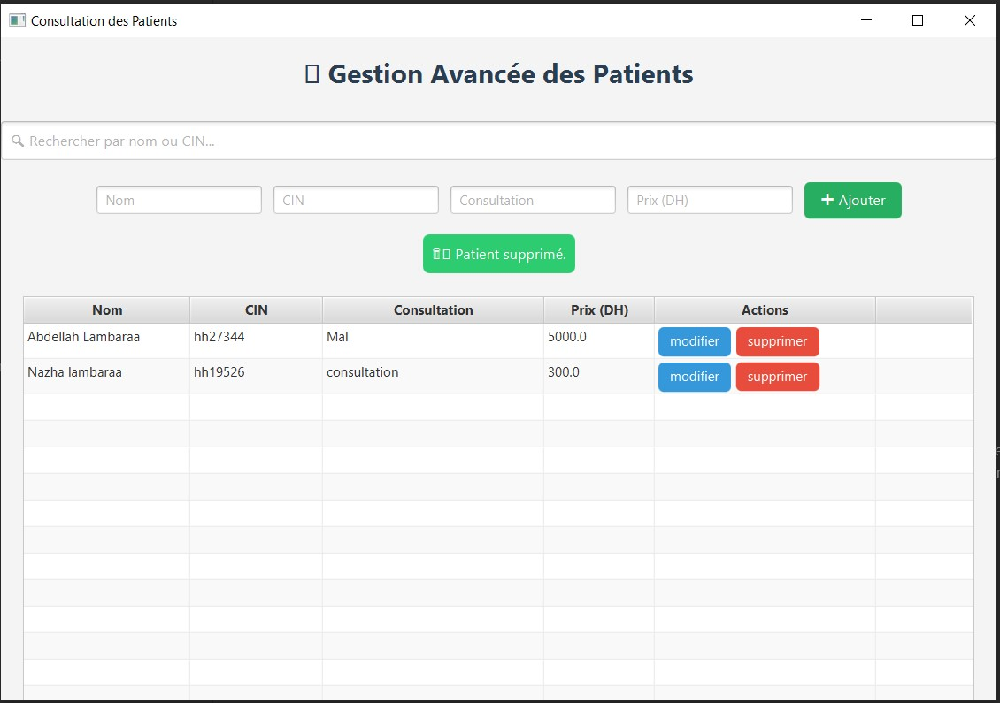
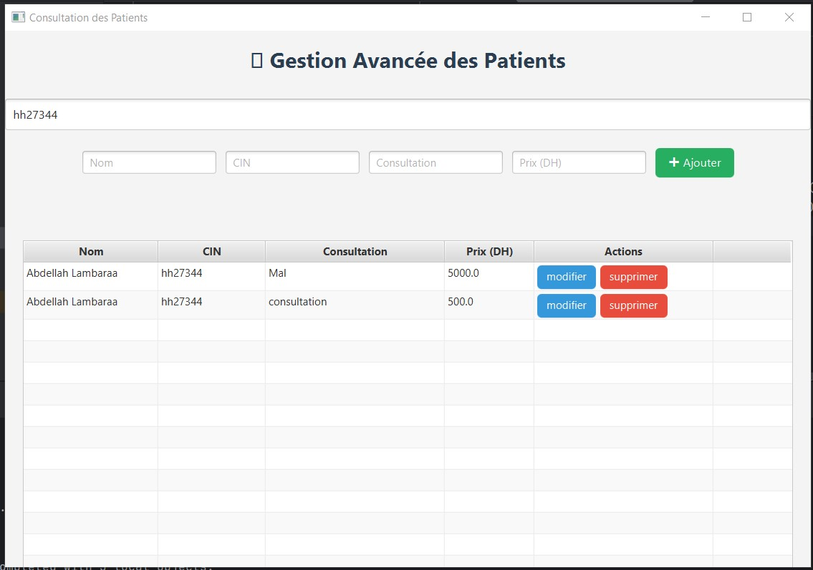
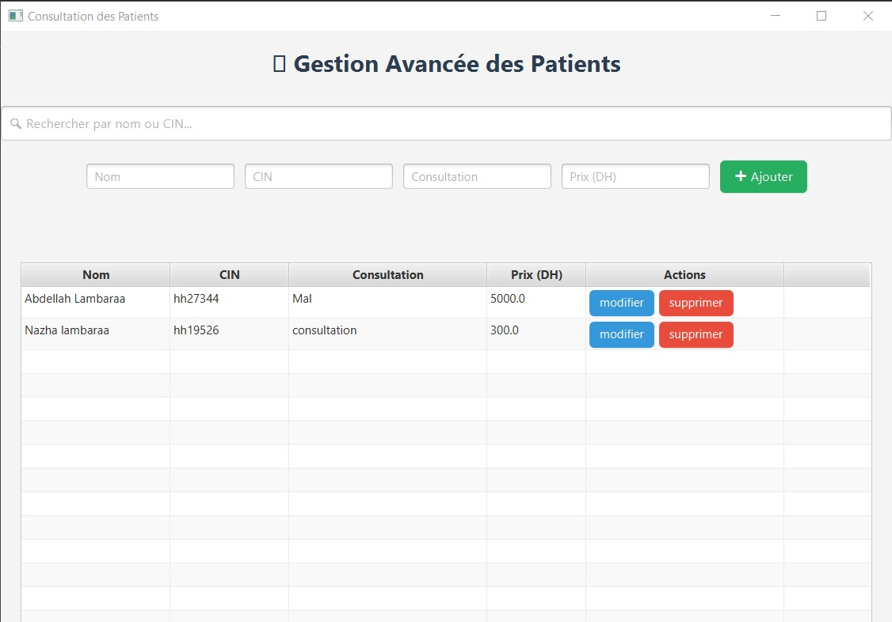
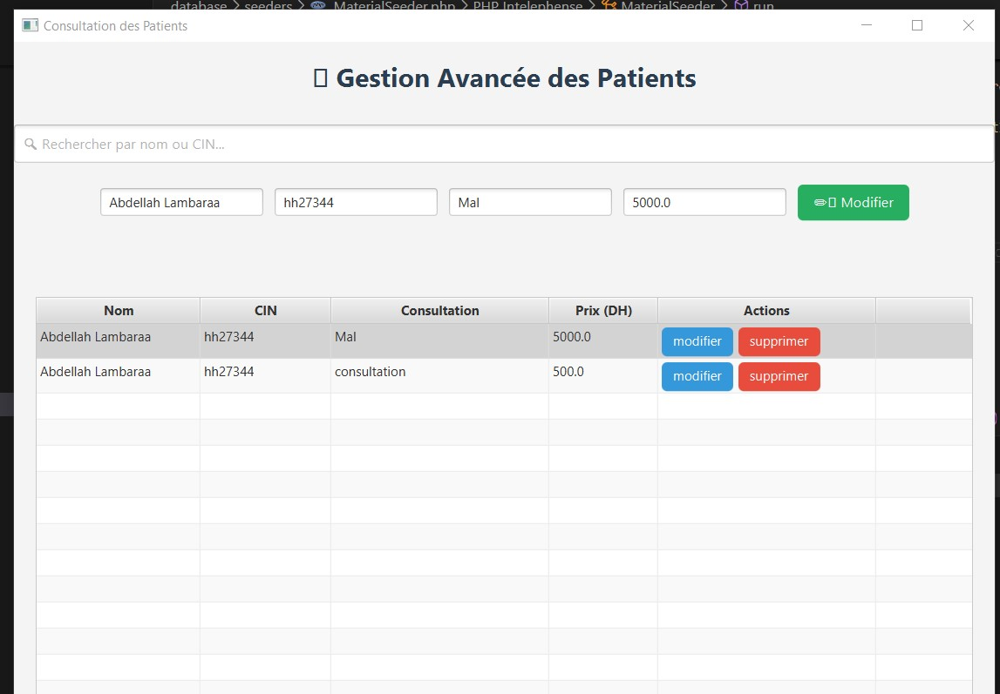
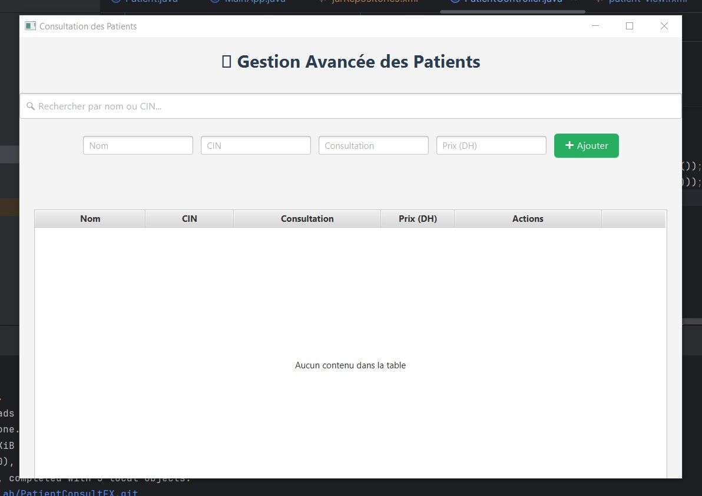
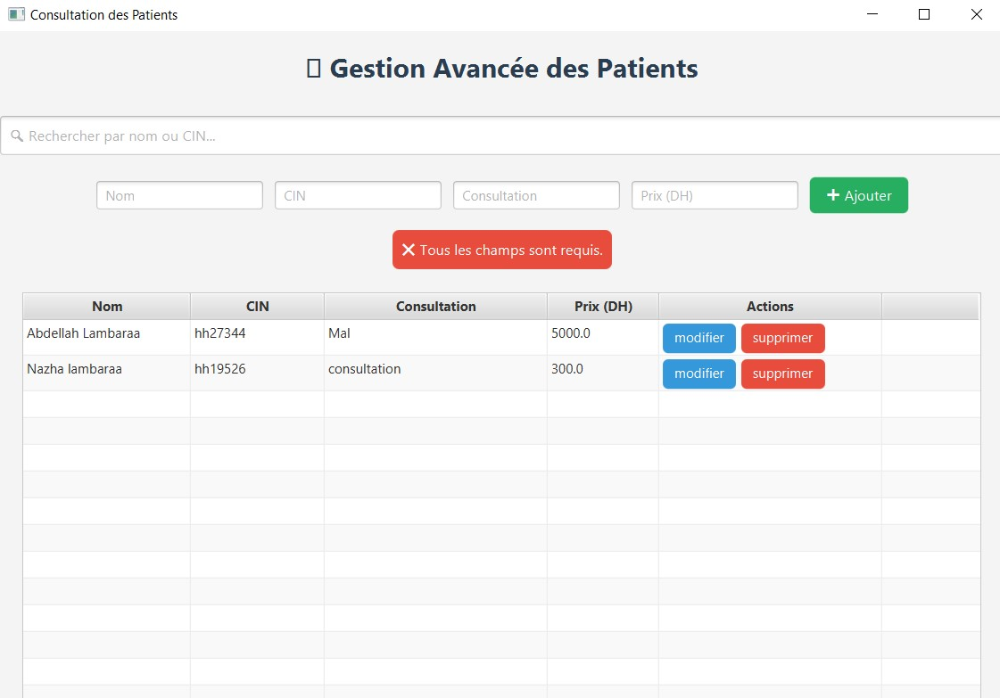

# 🩺 PatientConsultFX

Application JavaFX pour la gestion des consultations des patients.  
Projet développé dans le cadre du **Devoir 1** encadré par **Abdelmajid BOUSSELHAM**.

---

## 🎯 Objectifs du projet

- Gérer les informations des patients (nom, CIN, consultation, prix).
- Concevoir une interface graphique ergonomique avec JavaFX.
- Appliquer l’architecture MVC (Modèle – Vue – Contrôleur).
- Manipuler des composants JavaFX : `TextField`, `TableView`, `Button`, etc.
- Utiliser Maven pour la gestion des dépendances et l'exécution du projet.

---

## 🛠️ Technologies utilisées

| Outil / Langage | Version      |
|-----------------|--------------|
| Java            | 17           |
| JavaFX          | 17.0.6       |
| Maven           | 3.x          |
| FXML            | Oui (JavaFX UI) |
| CSS             | Personnalisé |
| IDE             | IntelliJ / VS Code / NetBeans |

---

## 📸 Aperçu de l'application

### ➕ Ajouter un patient


### 🗑️ Supprimer un patient


### 🔍 Recherche dynamique (par nom ou CIN)


### 📋 Liste affichée


### ✏️ Modifier un patient


### 📭 Table vide


### ❌ Validation des champs


---

## ✅ Fonctionnalités clés

- Ajout, modification et suppression de patients
- TableView responsive à 100% avec colonnes Nom, CIN, Consultation, Prix
- Formulaire réactif avec bouton contextuel (Ajouter/Modifier)
- Alertes stylées (succès, erreur)
- Recherche dynamique par nom ou CIN
- Design moderne avec CSS

---

## ⚙️ Lancer l'application localement

1. Cloner ce dépôt :

```bash
git clone https://github.com/LAMBARAA-Abdellah/PatientConsultFX.git
cd PatientConsultFX
