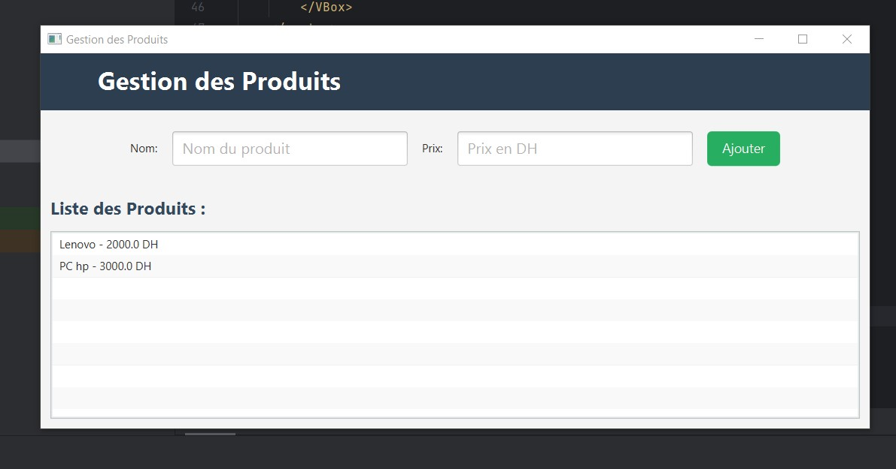
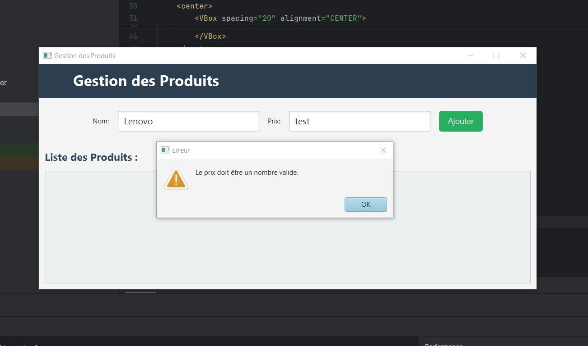

# 💼 ProductFX

Une application JavaFX simple et élégante pour gérer une liste de produits avec nom et prix. L’interface moderne permet d’ajouter dynamiquement des produits, avec validation des champs, et un affichage clair dans une `ListView`.

---

## 🧪 Fonctionnalités

- 🖥️ Interface graphique moderne avec JavaFX
- ✅ Ajout dynamique de produits (nom + prix)
- ⚠️ Validation des champs : empêche les champs vides et les prix invalides
- 📋 Affichage des produits en liste
- 💅 Design responsive et élégant avec CSS

---

## 📸 Captures d'écran

### 🧩 Interface principale



### ⚠️ Validation du prix



---

## 🛠️ Technologies utilisées

- Java 17
- JavaFX 17.0.6
- Maven
- CSS

---

## 🚀 Démarrage local

1. **Cloner le dépôt :**

```bash
git clone https://github.com/LAMBARAA-Abdellah/ProductFX.git
cd ProductFX
